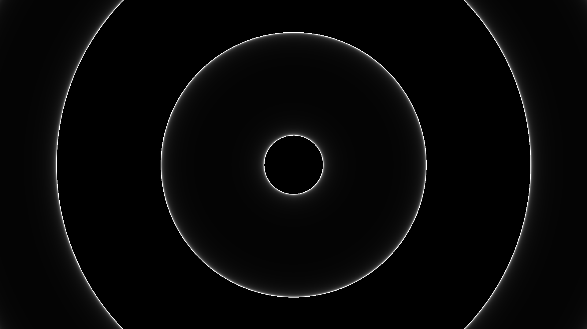

# Week 1: Writing my first shader

I spent this first week learning the (OpenGL) rendering pipeline and I figured it would be interesting to experiment with shaders. and after learning about the concept of shaders, I thought it would be interesting to exepriment with them myself.  

To write my shader, I used the website [Shadertoy](https://www.shadertoy.com/). Shadertoy is a website that streamlines the process of writing fragment shaders, meaning that the website provides you with everythign you need to begin writing fragment shaders.   

Here's a static image of the shader (Couldn't get gifs working for some reason yet)  

## [Link to Shadertoy](https://www.shadertoy.com/view/MXycDR)
